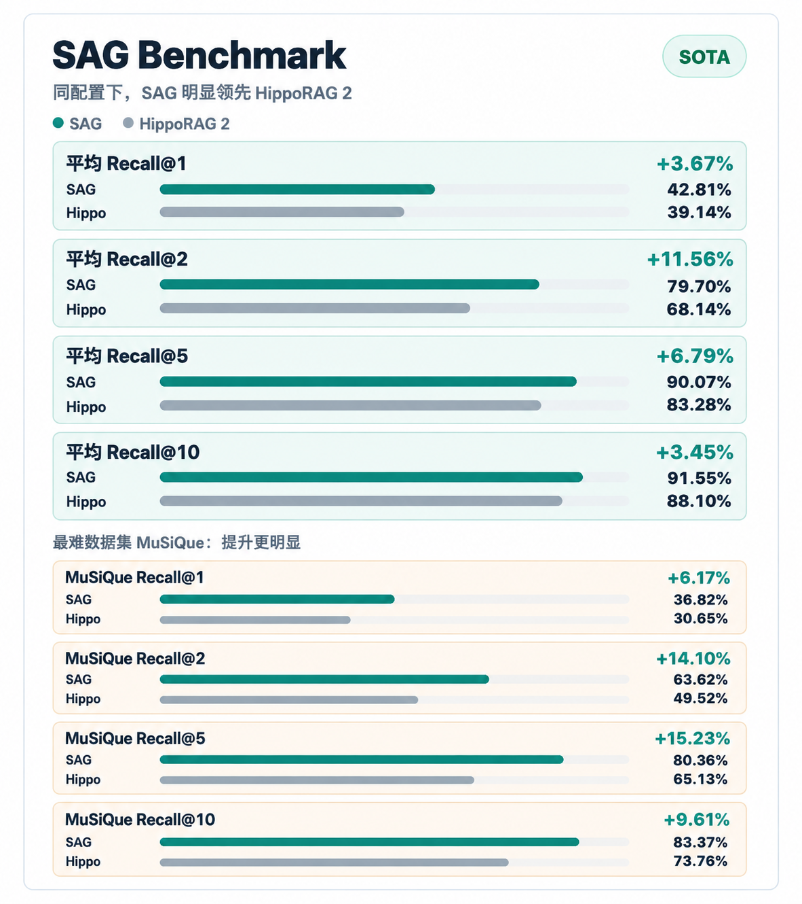
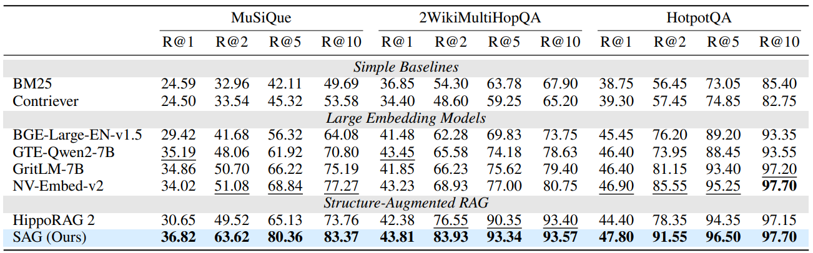
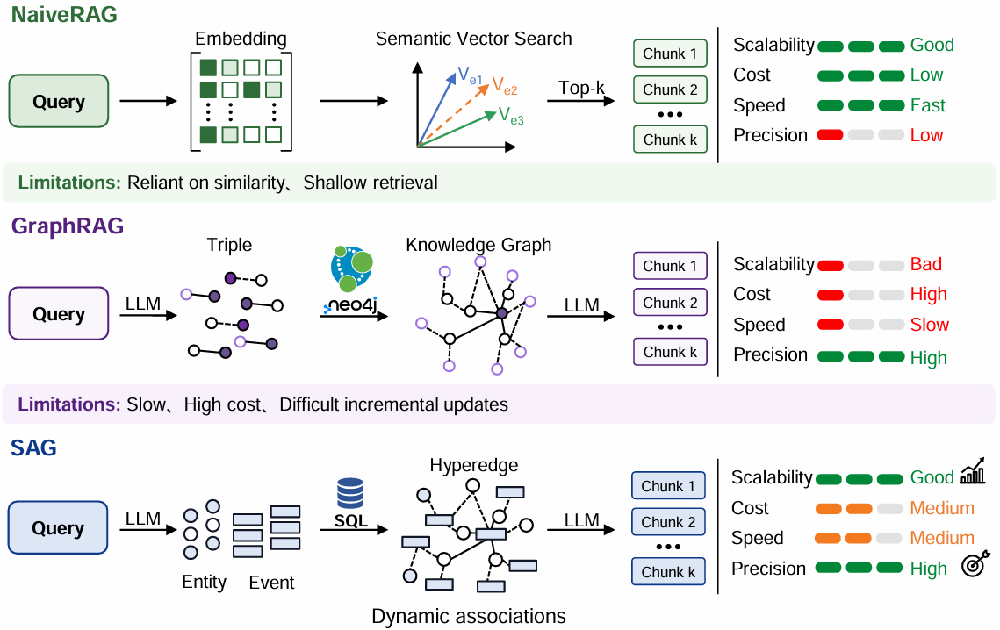
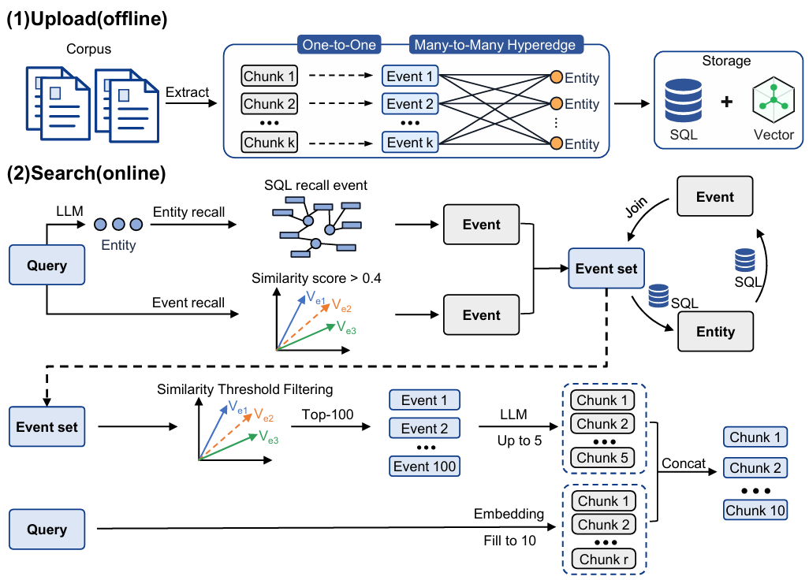

<p align="center">
  
</p>

# SAG Benchmark

> SAG 论文配套 Benchmark 复现代码库。该仓库用于按快速开始命令复现论文中的 Benchmark 分数，普通用户请看[SAG项目](https://github.com/Zleap-AI/SAG)

[English](README.md) | 中文

**论文链接：**[https://arxiv.org/abs/2608.12129](https://arxiv.org/abs/2608.12129)

<p align="center">
  
</p>

## Benchmark 分数复现

本仓库提供 SAG 在 HotpotQA、2WikiMultiHopQA 和 MuSiQue 上的上传、检索与评估脚本。核心目标是让读者按下方快速复现命令跑出论文中的 Benchmark 结果，并使用 Recall@1 / Recall@2 / Recall@5 / Recall@10 与各类检索及 RAG 方法进行比较。

论文默认实验配置：

| 配置项 | 值 |
|------|------|
| Embedding | `bge-large-en-v1.5` |
| LLM | `qwen3.6-flash` |
| 论文主要指标 | Recall@1 / Recall@2 / Recall@5 / Recall@10 |
| 主要脚本 | `scripts/run_upload.py`、`scripts/run_search_benchmark.py` |

主要结果：

<p align="center">
  
</p>

- SAG 在三个数据集上的平均 Recall@1、Recall@2、Recall@5 和 Recall@10 分别达到 **42.81%**、**79.70%**、**90.07%** 和 **91.55%**，相比 HippoRAG 2 分别提升 **3.67**、**11.56**、**6.79** 和 **3.44** 个百分点。
- SAG 在最具挑战的 MuSiQue 数据集上，其 Recall@1、Recall@2、Recall@5 和 Recall@10 相比 HippoRAG 2 分别提升 **6.17**、**14.10**、**15.23** 和 **9.61** 个百分点。

## 方法图示

<p align="center">
  
</p>

SAG 将文本组织为轻量的 `chunk -> event`、`chunk -> entities`、`event <-> entities` 结构。它不维护重型全局知识图谱，而是把 event/entity 索引用于 SQL、向量、全文检索和多跳扩展。

<p align="center">
  
</p>

## 快速开始

### 1. 安装依赖

要求：

- Python 3.11+
- `uv`
- Docker Compose
- 可用的 LLM、Embedding、Rerank 服务端点

```bash
uv sync
cp .env.example .env
```

如果需要直接运行 Python 命令，可以先激活虚拟环境：

```bash
source .venv/bin/activate
```

Windows PowerShell 使用：

```powershell
.\.venv\Scripts\Activate.ps1
```

编辑 `.env`，填写存储后端、LLM、Embedding 和 Rerank 配置。不要提交真实密钥。

上传或检索前，至少检查这些 `.env` 配置：

```env
STORAGE_PROFILE=mysql_es

LLM_API_KEY=sk-...
LLM_BASE_URL=https://...
LLM_MODEL=qwen3.6-flash
LLM_LANGUAGE=en

EMBEDDING_API_KEY=...
EMBEDDING_BASE_URL=http://...
EMBEDDING_MODEL_NAME=text-embedding-bge-large-en-v1.5
EMBEDDING_DIMENSIONS=1024

RERANK_BASE_URL=http://...
RERANK_MODEL_NAME=Qwen/Qwen3-Reranker-8B
RERANK_ENDPOINT=/rerank
```

然后按当前 profile 填写对应的存储连接：

```env
# mysql_es
MYSQL_HOST=localhost
MYSQL_PORT=3306
MYSQL_USER=sag2
MYSQL_PASSWORD=sag2_pass
MYSQL_DATABASE=sag2

# oceanbase_es / oceanbase_full
OCEANBASE_HOST=localhost
OCEANBASE_PORT=2881
OCEANBASE_USER=sag2@sag2
OCEANBASE_PASSWORD=sag2_pass
OCEANBASE_DATABASE=sag2

# mysql_es / oceanbase_es
ES_HOST=localhost
ES_PORT=9200
ES_SCHEME=http
```

存储后端通过 `STORAGE_PROFILE` 选择。应用层统一调用存储门面，上传和检索逻辑不需要知道向量最终写入 Elasticsearch 还是 OceanBase。

| Profile | SQL 数据库 | 向量/搜索后端 | 说明 |
|------|------|------|------|
| `mysql_es` | MySQL | Elasticsearch | 默认论文复现兼容模式 |
| `oceanbase_es` | OceanBase | Elasticsearch | 结构化表使用 OceanBase，向量搜索仍使用 ES |
| `oceanbase_full` | OceanBase | OceanBase | 向量直接存入 OceanBase 主表列，并使用 OceanBase 向量索引检索 |

`DATABASE_BACKEND` 和 `VECTOR_BACKEND` 是高级覆盖项。一般保持为空，让系统根据 `STORAGE_PROFILE` 自动推导。

### 2. 启动基础服务

所有本地服务由 `docker-compose.yml` 管理。

| 服务 | 容器名 | 默认端口 | 说明 |
|------|--------|----------|------|
| MySQL | `sag2_mysql` | `3306` | 默认用户 `sag2` |
| Elasticsearch | `new_sag_elasticsearch` | `9200` | 已关闭安全认证 |
| OceanBase | `oceanbase-ce` | `2881` | `oceanbase_es` / `oceanbase_full` 可选后端 |
| MLflow | `sag2_mlflow` | `5000` | 可选实验记录 |

端口可在 `.env` 中通过 `MYSQL_PORT`、`ES_PORT`、`MLFLOW_PORT` 覆盖。OceanBase SQL 客户端端口为 `2881`。

按当前 `STORAGE_PROFILE` 选择一个启动方式即可，不需要全部执行。

#### 2.1 `mysql_es`

```bash
docker compose up -d mysql elasticsearch
docker compose ps
```

#### 2.2 `oceanbase_es`

```bash
docker compose up -d oceanbase elasticsearch
docker compose ps
```

使用 `oceanbase_es` 时，需要等 OceanBase 容器日志显示租户 DDL 已就绪并完成 `init.sql` 后，再执行项目初始化：

```text
==> sag2 tenant ready.
==> Waiting for sag2 tenant DDL...
==> sag2 tenant DDL ready.
==> init.sql executed.
==> All done.
```

#### 2.3 `oceanbase_full`

```bash
docker compose up -d oceanbase
docker compose ps
```

使用 `oceanbase_full` 时，同样需要等 OceanBase 容器日志显示租户 DDL 已就绪并完成 `init.sql`：

```text
==> sag2 tenant ready.
==> Waiting for sag2 tenant DDL...
==> sag2 tenant DDL ready.
==> init.sql executed.
==> All done.
```

如果需要 MLflow 实验记录，可以单独启动：

```bash
docker compose up -d mlflow
```

### 3. 初始化数据库和索引

按当前 `STORAGE_PROFILE` 选择一个初始化方式即可，不需要全部执行。

#### 3.1 `mysql_es`

```bash
uv run python scripts/init_database.py --fix-grants
uv run python scripts/init_elasticsearch.py
```

#### 3.2 `oceanbase_es`

```bash
uv run python scripts/init_database.py
uv run python scripts/init_elasticsearch.py
```

#### 3.3 `oceanbase_full`

```bash
uv run python scripts/init_database.py
```

`scripts/init_database.py` 会读取 `STORAGE_PROFILE` 并初始化当前 SQL 后端：

- `mysql_es`：创建普通 MySQL 结构化表。
- `oceanbase_es`：创建普通 OceanBase 结构化表，并补齐 OceanBase 专用兼容列，例如 `source_event.entities`。
- `oceanbase_full`：包含 `oceanbase_es` 的所有步骤，并幂等补齐 chunk、event、entity、event-entity 的 OceanBase 向量列和向量索引。

只有向量后端是 Elasticsearch 时才需要执行 `scripts/init_elasticsearch.py`，也就是 `mysql_es` 或 `oceanbase_es`。`oceanbase_full` 不需要 ES 索引初始化。`--fix-grants` 只用于本地 MySQL 权限修复，OceanBase profile 不要使用。

### 4. 上传数据集

`run_upload.py` 会先把 `pipeline/evaluation/dataset/<dataset>.json` 转为 Markdown corpus，再通过统一存储门面写入结构化数据和向量。`mysql_es` 会写入 MySQL + Elasticsearch，`oceanbase_full` 会把结构化数据和向量都写入 OceanBase。上传完成后会生成：

```text
pipeline/evaluation/source/SAG/<LLM_MODEL>/<dataset>/<timestamp>/source_info.json
```

该文件包含后续 benchmark 使用的 `source_config_id`。

```bash
uv run python scripts/run_upload.py --dataset hotpotqa
uv run python scripts/run_upload.py --dataset 2wikimultihopqa
uv run python scripts/run_upload.py --dataset musique
```

快速调试可先使用小数据集：

```bash
uv run python scripts/run_upload.py --dataset test_hotpotqa
uv run python scripts/run_upload.py --dataset sample
```

如果要复现**三元组（原子事项）**模式——即每个事项恰好包含 2 个实体（主体-关系-客体）——在上传时加上 `--atomic`：

```bash
uv run python scripts/run_upload.py --dataset sample --atomic
```


### 5. 运行论文复现 benchmark

快速验证：

```bash
uv run python scripts/run_search_benchmark.py \
  --dataset-name test_hotpotqa \
  --strategy multi \
  --top-k 10 \
  --k-values "1,2,5,10" \
  --max-concurrency 5 \
  --limit 10
```

复现主要数据集：

```bash
uv run python scripts/run_search_benchmark.py \
  --dataset-name hotpotqa \
  --strategy multi \
  --top-k 10 \
  --k-values "1,2,5,10" \
  --max-concurrency 10 \
  --bench-size 20

uv run python scripts/run_search_benchmark.py \
  --dataset-name 2wikimultihopqa \
  --strategy multi \
  --top-k 10 \
  --k-values "1,2,5,10" \
  --max-concurrency 10 \
  --bench-size 20

uv run python scripts/run_search_benchmark.py \
  --dataset-name musique \
  --strategy multi \
  --top-k 10 \
  --k-values "1,2,5,10" \
  --max-concurrency 10 \
  --bench-size 20
```

如果需要固定数据源，直接传入上传阶段生成的 `source_config_id`：

```bash
uv run python scripts/run_search_benchmark.py \
  --dataset-name musique \
  --strategy multi \
  --source-config-id musique-20260512_213908 \
  --top-k 10 \
  --k-values "1,2,5,10" \
  --max-concurrency 10
```

启用 MLflow：

```bash
uv run python scripts/run_search_benchmark.py \
  --dataset-name musique \
  --strategy multi \
  --use-mlflow \
  --mlflow-url http://localhost:5000 \
  --mlflow-experiment sag-benchmark
```

输出目录默认是：

```text
output/<dataset>/<strategy>/<timestamp>/
```

主要输出文件：

| 文件 | 说明 |
|------|------|
| `search_results.json` | 每条问题的检索结果 |
| `benchmark_results.json` | Recall、Precision、F1 等评估结果 |
| `run.log` | 本次运行日志 |

## 数据集

| 名称 | 说明 |
|------|------|
| `hotpotqa` | HotpotQA 多跳问答 |
| `2wikimultihopqa` | 2WikiMultiHopQA |
| `musique` | MuSiQue 多跳问答 |
| `test_hotpotqa` | HotpotQA 小测试集 |
| `sample` | 极小样本集，用于流程调试 |

数据文件位于 `pipeline/evaluation/dataset/`。

## 检索策略

| 策略 | 说明 |
|------|------|
| `multi` | 多路检索，NER、实体向量召回、多跳扩展后合并排序 |
| `multi1` | 固定 1 跳并动态扩跳至满足候选规模 |
| `multi_es` | 支持 `--mode fast/precise` 的多路检索实现 |
| `hopllm` | 粗排后以种子结果继续扩跳 |
| `atomic` | 原子检索，先拆实体再逐跳扩展 |
| `vector` | 纯向量检索基线 |

完整参数见 [docs/search.md](docs/search.md)。

## 常用脚本

### 纯搜索

```bash
uv run python scripts/run_search.py \
  --dataset-name test_hotpotqa \
  --strategy multi \
  --output-dir output/manual-search
```

### 纯评估

```bash
uv run python scripts/run_benchmark.py \
  --results output/<dataset>/<strategy>/<timestamp>/search_results.json \
  --dataset musique
```

### 对比两个检索结果

```bash
uv run python scripts/compare_recall_methods.py \
  --predictions \
    output/test_hotpotqa/multi/run_a/search_results.json \
    output/test_hotpotqa/vector/run_b/search_results.json \
  --dataset-name test_hotpotqa \
  --k-values 1,2,5,10 \
  --verbose
```

## 项目结构

```text
SAG-Benchmark/
├── assets/                         # README 图片与 Logo
├── pipeline/
│   ├── core/                       # 配置、AI 客户端、存储层
│   ├── db/                         # SQLAlchemy ORM
│   ├── evaluation/
│   │   ├── dataset/                # 评测数据集
│   │   ├── metrics/                # Recall 等指标
│   │   └── utils/                  # 数据加载、MLflow、token 统计
│   ├── modules/
│   │   ├── extract/                # event/entity 抽取
│   │   ├── load/                   # 文档加载与分块
│   │   └── search/                 # 检索策略
│   ├── storage/                    # 存储门面与后端 Provider
│   └── utils/
├── scripts/
│   ├── init_database.py
│   ├── init_oceanbase_vectors.py
│   ├── init_elasticsearch.py
│   ├── run_upload.py
│   ├── run_search_benchmark.py
│   ├── run_search.py
│   ├── run_benchmark.py
│   └── compare_recall_methods.py
├── docs/
├── docker-compose.yml
├── .env.example
├── README.md
└── README-CN.md
```

## 复现注意事项

- 结果依赖 `.env` 中实际配置的 LLM、Embedding、Rerank 服务；模型、维度或 rerank 配置变化会影响指标。
- 存储行为由 `STORAGE_PROFILE` 决定。初始化、上传、搜索建议保持同一个 profile，除非你明确在做数据迁移。
- OceanBase 向量检索统一使用 `COSINE` 距离，并基于返回的 cosine distance 转成兼容 ES 习惯的 `_score`。近似 ANN 检索使用 OceanBase `APPROX LIMIT ... PARAMETERS (ef_search=...)`。
- `run_search_benchmark.py` 未显式传 `--source-config-id` 时，会按 `.env` 的 `LLM_MODEL` 查找最新上传的数据源。
- 完整数据集上传和 benchmark 会调用外部模型服务，运行前请确认额度、并发和超时配置。
- 停止本地服务使用 `docker compose down`；如需删除本地数据库卷，使用 `docker compose down -v`，该操作会清空已上传数据。
