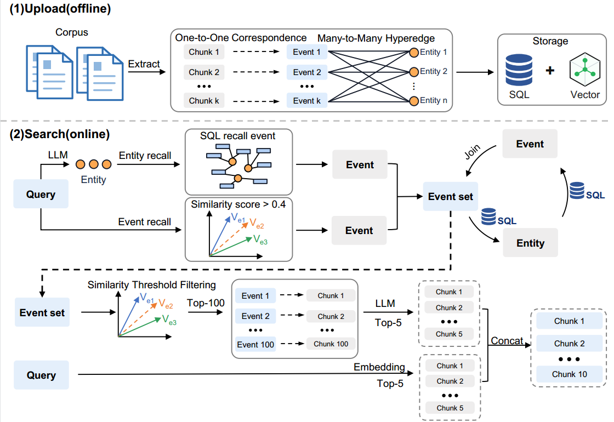

<p align="center">
  
</p>

# SAG Benchmark

> SAG 论文配套 Benchmark 复现代码库。该仓库用于按快速开始命令复现论文中的 Benchmark 分数，不是面向普通终端用户的产品说明。

[English](README.en.md) | 中文

**论文链接：** 待补充

<p align="center">
  
</p>

## Benchmark 分数复现

本仓库提供 SAG 在 HotpotQA、2WikiMultiHopQA 和 MuSiQue 上的上传、检索与 Recall 评估脚本。核心目标是让读者按下方快速复现命令跑出论文中的 Benchmark 分数，尤其是 Recall@1 / Recall@2 / Recall@5 / Recall@10。

论文默认实验配置：

| 配置项 | 值 |
|------|------|
| Embedding | `bge-large-en-v1.5` |
| LLM | `qwen3.6-flash` |
| 主要评估指标 | Recall@1 / Recall@2 / Recall@5 / Recall@10 |
| 主要脚本 | `scripts/run_upload.py`、`scripts/run_search_benchmark.py` |

参考结果：

| 方法 | 数据集 | Recall@1 | Recall@2 | Recall@5 | Recall@10 |
|------|--------|----------|----------|----------|-----------|
| **SAG** | HotpotQA | **47.80%** | **91.55%** | **96.50%** | **97.70%** |
| HippoRAG 2 | HotpotQA | 44.40% | 78.35% | 94.35% | 97.15% |
| **SAG** | 2WikiMultiHopQA | **43.53%** | **82.30%** | 88.00% | 88.75% |
| HippoRAG 2 | 2WikiMultiHopQA | 42.38% | 76.55% | 90.35% | 93.40% |
| **SAG** | MuSiQue | **36.17%** | **64.05%** | **80.04%** | **83.37%** |
| HippoRAG 2 | MuSiQue | 30.65% | 49.52% | 65.13% | 73.76% |
| **SAG** | **平均** | **42.50%** | **79.30%** | **88.18%** | **89.94%** |
| HippoRAG 2 | **平均** | 39.14% | 68.14% | 83.28% | 88.10% |

使用 NV-Embed-v2 时，MuSiQue 上的 SAG Recall@5 为 **81.71%**，HippoRAG 2 为 74.55%。

## 方法图示

<p align="center">
  
</p>

SAG 将文本组织为轻量的 `chunk -> event`、`chunk -> entities`、`event <-> entities` 结构。它不维护重型全局知识图谱，而是把 event/entity 索引用于 SQL、向量、全文检索和多跳扩展。

<p align="center">
  
</p>

## 快速开始

### 1. 安装依赖

要求：

- Python 3.11+
- `uv`
- Docker Compose
- 可用的 LLM、Embedding、Rerank 服务端点

```bash
uv sync
cp .env.example .env
```

编辑 `.env`，填写 MySQL、Elasticsearch、LLM、Embedding 和 Rerank 配置。不要提交真实密钥。

### 2. 启动基础服务

所有本地服务由 `docker-compose.yml` 管理。

| 服务 | 容器名 | 默认端口 | 说明 |
|------|--------|----------|------|
| MySQL | `sag2_mysql` | `3306` | 默认用户 `sag2` |
| Elasticsearch | `new_sag_elasticsearch` | `9200` | 已关闭安全认证 |
| MLflow | `sag2_mlflow` | `5000` | 可选实验记录 |

端口可在 `.env` 中通过 `MYSQL_PORT`、`ES_PORT`、`MLFLOW_PORT` 覆盖。

```bash
docker compose up -d
docker compose ps
```

### 3. 初始化数据库和索引

```bash
uv run python scripts/init_database.py --fix-grants
uv run python scripts/init_elasticsearch.py
```

### 4. 上传数据集

`run_upload.py` 会先把 `pipeline/evaluation/dataset/<dataset>.json` 转为 Markdown corpus，再写入数据库和 Elasticsearch。上传完成后会生成：

```text
pipeline/evaluation/source/SAG/<LLM_MODEL>/<dataset>/<timestamp>/source_info.json
```

该文件包含后续 benchmark 使用的 `source_config_id`。

```bash
uv run python scripts/run_upload.py --dataset hotpotqa
uv run python scripts/run_upload.py --dataset 2wikimultihopqa
uv run python scripts/run_upload.py --dataset musique
```

快速调试可先使用小数据集：

```bash
uv run python scripts/run_upload.py --dataset test_hotpotqa
uv run python scripts/run_upload.py --dataset sample
```

如果要复现**三元组（原子事项）**模式——即每个事项恰好包含 2 个实体（主体-关系-客体）——在上传时加上 `--atomic`：

```bash
uv run python scripts/run_upload.py --dataset sample --atomic
```


### 5. 运行论文复现 benchmark

快速验证：

```bash
uv run python scripts/run_search_benchmark.py \
  --dataset-name test_hotpotqa \
  --strategy multi \
  --top-k 10 \
  --k-values "1,2,5,10" \
  --max-concurrency 5 \
  --limit 10
```

复现主要数据集：

```bash
uv run python scripts/run_search_benchmark.py \
  --dataset-name hotpotqa \
  --strategy multi \
  --top-k 10 \
  --k-values "1,2,5,10" \
  --max-concurrency 10 \
  --bench-size 20

uv run python scripts/run_search_benchmark.py \
  --dataset-name 2wikimultihopqa \
  --strategy multi \
  --top-k 10 \
  --k-values "1,2,5,10" \
  --max-concurrency 10 \
  --bench-size 20

uv run python scripts/run_search_benchmark.py \
  --dataset-name musique \
  --strategy multi \
  --top-k 10 \
  --k-values "1,2,5,10" \
  --max-concurrency 10 \
  --bench-size 20
```

如果需要固定数据源，直接传入上传阶段生成的 `source_config_id`：

```bash
uv run python scripts/run_search_benchmark.py \
  --dataset-name musique \
  --strategy multi \
  --source-config-id musique-20260512_213908 \
  --top-k 10 \
  --k-values "1,2,5,10" \
  --max-concurrency 10
```

启用 MLflow：

```bash
uv run python scripts/run_search_benchmark.py \
  --dataset-name musique \
  --strategy multi \
  --use-mlflow \
  --mlflow-url http://localhost:5000 \
  --mlflow-experiment sag-benchmark
```

输出目录默认是：

```text
output/<dataset>/<strategy>/<timestamp>/
```

主要输出文件：

| 文件 | 说明 |
|------|------|
| `search_results.json` | 每条问题的检索结果 |
| `benchmark_results.json` | Recall、Precision、F1 等评估结果 |
| `run.log` | 本次运行日志 |

## 数据集

| 名称 | 说明 |
|------|------|
| `hotpotqa` | HotpotQA 多跳问答 |
| `2wikimultihopqa` | 2WikiMultiHopQA |
| `musique` | MuSiQue 多跳问答 |
| `test_hotpotqa` | HotpotQA 小测试集 |
| `sample` | 极小样本集，用于流程调试 |

数据文件位于 `pipeline/evaluation/dataset/`。

## 检索策略

| 策略 | 说明 |
|------|------|
| `multi` | 多路检索，NER、实体向量召回、多跳扩展后合并排序 |
| `multi1` | 固定 1 跳并动态扩跳至满足候选规模 |
| `multi_es` | 支持 `--mode fast/precise` 的多路检索实现 |
| `hopllm` | 粗排后以种子结果继续扩跳 |
| `atomic` | 原子检索，先拆实体再逐跳扩展 |
| `vector` | 纯向量检索基线 |

完整参数见 [docs/search.md](docs/search.md)。

## 常用脚本

### 纯搜索

```bash
uv run python scripts/run_search.py \
  --dataset-name test_hotpotqa \
  --strategy multi \
  --output-dir output/manual-search
```

### 纯评估

```bash
uv run python scripts/run_benchmark.py \
  --results output/<dataset>/<strategy>/<timestamp>/search_results.json \
  --dataset musique
```

### 对比两个检索结果

```bash
uv run python scripts/compare_recall_methods.py \
  --predictions \
    output/test_hotpotqa/multi/run_a/search_results.json \
    output/test_hotpotqa/vector/run_b/search_results.json \
  --dataset-name test_hotpotqa \
  --k-values 1,2,5,10 \
  --verbose
```

## 项目结构

```text
SAG-Benchmark/
├── assets/                         # README 图片与 Logo
├── pipeline/
│   ├── core/                       # 配置、AI 客户端、存储层
│   ├── db/                         # SQLAlchemy ORM
│   ├── evaluation/
│   │   ├── dataset/                # 评测数据集
│   │   ├── metrics/                # Recall 等指标
│   │   └── utils/                  # 数据加载、MLflow、token 统计
│   ├── modules/
│   │   ├── extract/                # event/entity 抽取
│   │   ├── load/                   # 文档加载与分块
│   │   └── search/                 # 检索策略
│   └── utils/
├── scripts/
│   ├── init_database.py
│   ├── init_elasticsearch.py
│   ├── run_upload.py
│   ├── run_search_benchmark.py
│   ├── run_search.py
│   ├── run_benchmark.py
│   └── compare_recall_methods.py
├── docs/
├── docker-compose.yml
├── .env.example
└── README.md
```

## 复现注意事项

- 结果依赖 `.env` 中实际配置的 LLM、Embedding、Rerank 服务；模型、维度或 rerank 配置变化会影响指标。
- `run_search_benchmark.py` 未显式传 `--source-config-id` 时，会按 `.env` 的 `LLM_MODEL` 查找最新上传的数据源。
- 完整数据集上传和 benchmark 会调用外部模型服务，运行前请确认额度、并发和超时配置。
- 停止本地服务使用 `docker compose down`；如需删除本地数据库卷，使用 `docker compose down -v`，该操作会清空已上传数据。
